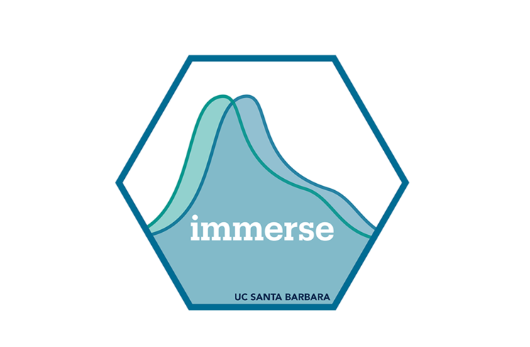

# Continued Training for IMMERSE

 

------------------------------------------------------------------------

The Institute of Mixture Modeling for Equity-Oriented Researchers, Scholars, and Educators (IMMERSE) is an IES funded training grant (R305B220021) to support education scholars in integrating mixture modeling into their research.

