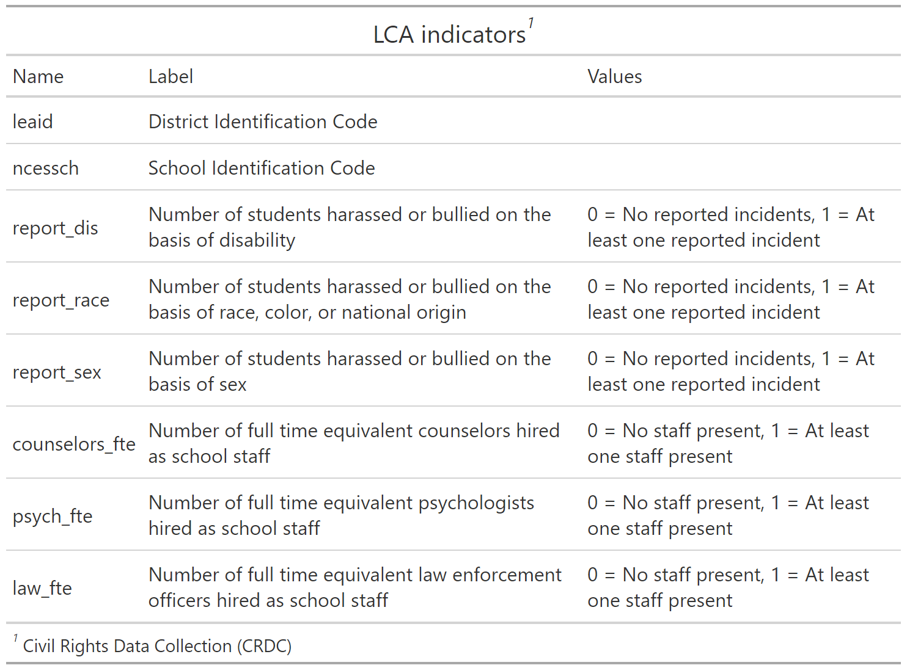

```{r, echo=FALSE}
htmltools::img(src = knitr::image_uri(file.path("figures/immerse_hex.png")), 
               alt = 'logo', 
               style = 'position:absolute; top:0; right:0; padding:10px;',
               width ="250",
               height ="193")
```

```{r setup, include=FALSE}
knitr::opts_chunk$set(echo = TRUE, 
                      warning = FALSE,
                      message = FALSE,
                      tidy.opts=list(width.cutoff=60)) #Here, I have made it so that when you knit your .rmd, warnings and messages will not show up in the html markdown. 

```

------------------------------------------------------------------------

[IMMERSE Project]{style="font-size: 24px;"}

{style="float: left;" width="300"}

The Institute of Mixture Modeling for Equity-Oriented Researchers, Scholars, and Educators (IMMERSE) is an IES funded training grant (R305B220021) to support education scholars in integrating mixture modeling into their research.

-   Please [visit our website](https://immerse.education.ucsb.edu/) to learn more.

-   Visit our [GitHub](https://github.com/immerse-ucsb) account to access all the IMMERSE materials.

-   Follow us on [Twitter](https://twitter.com/IMMERSE_UCSB)!

How to reference this workshop: Institute of Mixture Modeling for Equity-Oriented Researchers, Scholars, and Educators (2023).
IMMERSE Online Resources (IES No. 305B220021).
Institute of Education Sciences.
<https://immerse-ucsb.github.io/pre-training>

------------------------------------------------------------------------

### Example: Bullying in Schools

------------------------------------------------------------------------

To demonstrate mixture modeling in the training program and online resource components of the IES grant we utilize the *Civil Rights Data Collection (CRDC)* (CRDC) data repository.
The CRDC is a federally mandated school-level data collection effort that occurs every other year.
This public data is currently available for selected latent class indicators across 4 years (2011, 2013, 2015, 2017) and all US states.
In this example, we use the Arizona state sample.
We utilize six focal indicators which constitute the latent class model in our example; three variables which report on harassment/bullying in schools based on disability, race, or sex, and three variables on full-time equivalent school staff hires (counselor, psychologist, law enforcement).
This data source also includes covariates on a variety of subjects and distal outcomes reported in 2018 such as math/reading assessments and graduation rates.

------------------------------------------------------------------------

Load packages

```{r, cache = FALSE}

library(tidyverse)
library(haven)
library(glue)
library(MplusAutomation)
library(here)
library(janitor)
library(gt)
library(cowplot)
library(DiagrammeR) 
library(jtools)
here::i_am("lca_viz.Rmd")
```

### Variable Description

```{r, echo=FALSE, eval=TRUE}
info <- tribble(
   ~"Name",      ~"Label",  ~"Values",                                   
#--------------|--------------------------------|-----|,
  "leaid",   "District Identification Code", "",
  "ncessch",   "School Identification Code", "",
  "report_dis",   "Number of students harassed or bullied on the basis of disability",  "0 = No reported incidents, 1 = At least one reported incident",
  "report_race",  "Number of students harassed or bullied on the basis of race, color, or national origin",  "0 = No reported incidents, 1 = At least one reported incident",
  "report_sex", "Number of students harassed or bullied on the basis of sex",  "0 = No reported incidents, 1 = At least one reported incident",
  "counselors_fte", "Number of full time equivalent counselors hired as school staff",  "0 = No staff present, 1 = At least one staff present",  
  "psych_fte", "Number of full time equivalent psychologists hired as school staff",  "0 = No staff present, 1 = At least one staff present",
  "law_fte", "Number of full time equivalent law enforcement officers hired as school staff",  "0 = No staff present, 1 = At least one staff present") %>% 
gt() %>% 
  tab_header(
    title = "LCA indicators"  # Add a title
    ) %>%
  tab_options(
    table.width = pct(75)
  ) %>%
  tab_footnote(
    footnote = "Civil Rights Data Collection (CRDC)",
    location = cells_title()) 

#gtsave(info, "figures/info.png")
```



------------------------------------------------------------------------

### Latent Variable Diagram

```{r, eval=TRUE, fig.align='center'}

grViz(" digraph cfa_model {

# The `graph` statement - No editing needed

    graph [layout = dot, overlap = true]
 
# Two `node` statements
 
# One for measured variables (box) 

    node [shape=box]
    report_dis report_race report_sex counselors_fte psych_fte law_fte;
 
# One for latent variables (circle) 
 
    node [shape=circle]
    bully [label=<Bullying <br/>C<sub>k</sub>>];
    
# `edge` statements
 
    edge [minlen = 2]
    bully -> {report_dis report_race report_sex counselors_fte psych_fte law_fte}
 
 }") 
```


Alternative: draw.io

------------------------------------------------------------------------

### Prepare Data

```{r, eval=TRUE}
df_bully <- read_csv(here("data", "crdc_lca_data.csv")) %>% 
  clean_names() %>% 
  dplyr::select(report_dis, report_race, report_sex, counselors_fte, psych_fte, law_fte) 
```

------------------------------------------------------------------------

### Descriptive Statistics

```{r}
# Set up data to find proportions of binary indicators
ds <- df_bully %>% 
  pivot_longer(c(report_dis, report_race, report_sex, counselors_fte, psych_fte, law_fte), names_to = "variable") 


# Create table of variables and counts, then find proportions and round to 3 decimal places
prop_df <- ds %>%
  count(variable, value) %>%
  group_by(variable) %>%
  mutate(prop = n / sum(n)) %>%
  ungroup() %>%
  mutate(prop = round(prop, 3))


# Make it a gt() table
prop_table <- prop_df %>% 
  gt(groupname_col = "variable", rowname_col = "value") %>%
  tab_stubhead(label = md("*Values*")) %>%
  tab_header(
    md(
      "Variable Proportions"
    )
  ) %>%
  cols_label(
    variable = md("*Variable*"),
    value = md("*Value*"),
    n = md("*N*"),
    prop = md("*Proportion*")
  ) 
  
prop_table

# Save as img
gtsave(prop_table, here("figures", "prop_table.png"))

# save as docx
gtsave(prop_table, here("tables", "prop_table.docx"))
```

------------------------------------------------------------------------

### Table of Fit

After completing the Latent Class enumeration step, we can move forward with creating a table of fit for each model.

First, extract data:

```{r}
output_bully <- readModels(here("enum"), filefilter = "bully", quiet = TRUE)

enum_extract <- LatexSummaryTable(
  output_bully,
  keepCols = c(
    "Title",
    "Parameters",
    "LL",
    "BIC",
    "aBIC",
    "BLRT_PValue",
    "T11_VLMR_PValue",
    "Observations"
  ),
  sortBy = "Title"
) 


allFit <- enum_extract %>%
  mutate(CAIC = -2 * LL + Parameters * (log(Observations) + 1)) %>%
  mutate(AWE = -2 * LL + 2 * Parameters * (log(Observations) + 1.5)) %>%
  mutate(SIC = -.5 * BIC) %>%
  mutate(expSIC = exp(SIC - max(SIC))) %>%
  mutate(BF = exp(SIC - lead(SIC))) %>%
  mutate(cmPk = expSIC / sum(expSIC)) %>%
  dplyr::select(1:5, 9:10, 6:7, 13, 14) %>%
  arrange(Parameters)
```

Then, create table:

```{r}
fit_table <- allFit %>%
  gt() %>%
  tab_header(title = "Table 1", subtitle = md("*Model Fit Summary Table*")) %>%
  cols_label(
    Title = "Classes",
    Parameters = md("Par"),
    LL = md("*LL*"),
    T11_VLMR_PValue = "VLMR",
    BLRT_PValue = "BLRT",
    BF = md("BF"),
    cmPk = md("*cmPk*")
  ) %>%
  tab_footnote(
    footnote = md(
      "*Note.* Par = Parameters; *LL* = model log likelihood;
BIC = Bayesian information criterion;
aBIC = sample size adjusted BIC; CAIC = consistent Akaike information criterion;
AWE = approximate weight of evidence criterion;
BLRT = bootstrapped likelihood ratio test p-value;
VLMR = Vuong-Lo-Mendell-Rubin adjusted likelihood ratio test p-value;
*cmPk* = approximate correct model probability."
    )
  ) %>%
  cols_align(align = "center") %>%
  opt_table_font(font = "Times New Roman") %>%
  opt_align_table_header(align = "left") %>%
  tab_options(
    heading.title.font.size = px(16),
    heading.subtitle.font.size = px(16),
    row_group.as_column = TRUE,
    stub.border.width = 0,
    heading.border.bottom.color = "black",
    column_labels.border.top.color = "black",
    column_labels.border.bottom.color = "black",
    table_body.border.bottom.color = "black",
    table.border.bottom.color = "white",
    table.border.top.color = "white",
    table.background.color = "white"
  ) %>%
  tab_style(
    style = list(
      cell_borders(
        sides = c("top", "bottom"),
        color = "white",
        weight = px(1)
      ),
      cell_text(align = "center"),
      cell_fill(color = "white", alpha = NULL)
    ),
    locations = cells_body(columns = everything(),
                           rows = everything())
  ) %>% 
  tab_options(column_labels.font.weight = "bold") %>%
  fmt_number(c(3:7),
             decimals = 2) %>%
  sub_missing(1:11,
              missing_text = "--") %>%
  fmt(
    c(8:9, 11),
    fns = function(x)
      ifelse(x < .001, "&lt;.001",
             scales::number(x, accuracy = .01))
  ) %>%
  fmt(
    10,
    fns = function (x)
      ifelse(x > 100, ">100",
             scales::number(x, accuracy = .01))
  ) %>%  
  tab_style(
    style = list(
      cell_text(weight = "bold")
      ),
    locations = list(cells_body(
     columns = BIC,
     row = BIC == min(BIC[c(1:6)]) # Change this to the number of classes you are evaluating
    ),
    cells_body(
     columns = aBIC,
     row = aBIC == min(aBIC[1:6])
    ),
    cells_body(
     columns = CAIC,
     row = CAIC == min(CAIC[1:6])
    ),
    cells_body(
     columns = AWE,
     row = AWE == min(AWE[1:6])
    ),
    cells_body(
     columns = cmPk,
     row =  cmPk == max(cmPk[1:6])
     ),    
    cells_body(
     columns = BF,
     row =  BF > 10),
    cells_body( 
     columns =  T11_VLMR_PValue,
     row =  ifelse(T11_VLMR_PValue < .05 & lead(T11_VLMR_PValue) > .05, T11_VLMR_PValue < .05, NA)),
    cells_body(
     columns =  BLRT_PValue,
     row =  ifelse(BLRT_PValue < .05 & lead(BLRT_PValue) > .05, BLRT_PValue < .05, NA))
  )
)

fit_table
```

------------------------------------------------------------------------

Save table:

```{r}
# save as img
gtsave(fit_table, here("figures", "fit_table.png"))

# save as docx
gtsave(fit_table, here("tables", "fit_table.docx"))
```

------------------------------------------------------------------------

### Information Criteria Plot

```{r height=5, width=7}
allFit %>%
  dplyr::select(2:7) %>%
  rowid_to_column() %>%
  pivot_longer(`BIC`:`AWE`,
               names_to = "Index",
               values_to = "ic_value") %>%
  mutate(Index = factor(Index,
                        levels = c ("AWE", "CAIC", "BIC", "aBIC"))) %>%
  ggplot(aes(
    x = rowid,
    y = ic_value,
    color = Index,
    shape = Index,
    group = Index,
    lty = Index
  )) +
  geom_point(size = 2.0) + geom_line(linewidth = .8) +
  scale_x_continuous(breaks = 1:nrow(allFit)) +
  scale_colour_grey(end = .5) +
  theme_cowplot() +
  labs(
    title = "Figure XX",
    subtitle = "Information Criteria",
    x = "Number of Classes",
    y = "Information Criteria Value"
  ) +
  theme(
    text = element_text(family = "sans", size = 12),
    legend.text = element_text(family = "sans", size = 12),
    legend.key.width = unit(3, "line"),
    legend.title = element_blank(),
    legend.position = "top",
    plot.subtitle = element_text(face = "italic", size = 15),
    plot.title = element_text(size = 15)
  )
```

Save figure:

```{r}
ggsave(here("figures", "info_criteria.png"), dpi=300, bg = "white", height=5, width=7, units="in")
```

------------------------------------------------------------------------

Alternative view: ICs separately

```{r}
allFit %>%
  dplyr::select(1:7) %>%
  rowid_to_column() %>%
  pivot_longer(`LL`:`AWE`,
               names_to = "Index",
               values_to = "ic_value") %>%
  mutate(Index = factor(Index,
                        levels = c ("LL", "AWE", "CAIC", "BIC", "aBIC"))) %>%
  ggplot(aes(
    x = rowid,
    y = ic_value,
    color = Index,
    shape = Index,
    group = Index,
    lty = Index
  )) +
  geom_point(size = 2.0) + geom_line(size = .8) +
  scale_x_continuous(breaks = 1:nrow(allFit)) +  
  scale_colour_grey(end = .5) +
  theme_cowplot() +
  labs(
    title = "Figure XX",
    subtitle = "Information Criteria",
    x = "Number of Classes",
    y = "Information Criteria Value"
  ) +
  theme(
    legend.title = element_blank(),
    legend.position = "top",
    
    plot.subtitle = element_text(face = "italic", size = 15),
    plot.title = element_text(size = 15)
  ) +
  facet_wrap( ~ Index, scales = "free_y")
```

Save figure:

```{r}
ggsave(here("figures", "info_criteria_sep.png"), dpi='retina', bg = "white", height=5, width=7, units="in")
```

------------------------------------------------------------------------

### Probability Plots

Automatic:

Use the `plot_lca` function provided in the folder to plot the item probability plot.
This function requires one argument: - `model_name`: The name of the Mplus `readModels` object (e.g., `output_bully$c3_bully.out`)

```{r fig.height=6, fig.width=10}
source("plot_lca.txt")

plot_lca(model_name = output_bully$c3_bully.out)
```

Save figure:

```{r}
ggsave(here("figures", "automatic_line_plot.png"), dpi="retina", bg = "white", height=5, width=7, units="in")
```

------------------------------------------------------------------------

Customize:

```{r}
#### START EDIT ####

# Read in model
model <- output_bully$c3_bully.out

# Title
title <- "Bullying Probability Plot"

# Item names
item_labels <- c("Harassment: Disability",
           "Harassment: Race", 
           "Harassment: Sex",
           "School staff: Counselor",
           "School staff: Psychologist",
           "School staff: Law Enforcement")

# Class labels
class_labels <- c("Reported Harrassment (Low), \nStaff (High)",
            "Reported Harrassment (High), \nStaff (Low)",
            "Reported Harrassment (Low), \nStaff (Low)")


#### END EDIT ####
```

Extract data needed for plotting (don't edit):

```{r}
# Extract data needed for plotting (don't edit here)
plot_data <- data.frame(model$parameters$probability.scale) %>% 
  filter(category == 2) %>% 
  mutate(items = fct_inorder(param),
         class = fct_inorder(LatentClass)) %>% 
  mutate(items = factor(items, labels = item_labels),
         class = factor(class, labels = class_labels)) %>% 
  dplyr::select(est, se, class, items)
```

------------------------------------------------------------------------

Line Plot

```{r, fig.height=6, fig.width=10}
## Plot data
plot_data %>%
  ggplot(aes(
    x = items,
    y = est,
    shape = class,
    colour = class,
    lty = class,
    group = class
  )) +
  geom_point(size = 4) + geom_line() +
  ylim(0, 1) +
  scale_x_discrete(
    "",
    labels = function(x)
      str_wrap(x, width = 10)
  ) +
  labs(title = "Figure 1",
       subtitle = title,
       y = "Probability") +
  theme_cowplot() +
  scale_color_grey(start = 0, end = 0) +
  theme(
    text = element_text(family = "sans", size = 12),
    legend.text = element_text(family = "sans", size = 12),
    legend.key.width = unit(0, "line"),
    legend.title = element_blank(),
    legend.position = "bottom",
    axis.text.x = element_text(vjust = 1),
    plot.subtitle = element_text(face = "italic", size = 15),
    plot.title = element_text(size = 15)
  )

```

```{r}
ggsave(here("figures", "custom_line_plot.png"), dpi = "retina", bg = "white", height=6, width=9, units="in")
```

------------------------------------------------------------------------

Bar Plot:

```{r, fig.height=6, fig.width=10}
## Plot data
plot_data %>%
  ggplot(aes(x = items,
             y = est,
             fill = class)) +
  geom_bar(stat = "identity",
           position = "dodge",
           color = 'black') +
  geom_errorbar(
    aes(ymin = est - se, ymax = est + se),
    size = .3,
    width = .2,
    position = position_dodge(.9)
  ) +
  geom_text(
    aes(label = est),
    family = "sans",
    size = 4,
    position = position_dodge(.9),
    vjust = -3
  ) + # Change for location of text
  ylim(0, 1) +
  scale_x_discrete(
    "",
    labels = function(x)
      str_wrap(x, width = 10)
  ) + # Adds string wrap to item names
  labs(title = "Figure 1",
       subtitle = title,
       y = "Probability") +
  theme_cowplot() +
  scale_fill_grey(start = 0.2, end = .9) +
  theme(
    text = element_text(family = "sans", size = 12),
    legend.text = element_text(family = "sans", size = 12),
    legend.title = element_blank(),
    legend.position = "top",
    axis.text.x = element_text(vjust = 1),
    plot.subtitle = element_text(face = "italic", size = 15),
    plot.title = element_text(size = 15)
  ) 
```

```{r}
ggsave(here("figures", "custom_bar_plot.png"), dpi="retina", bg = "white", height=6, width=9, units="in")
```

`ggplot2` resources:

-   [Official ggplot2 Page](https://ggplot2.tidyverse.org/){.uri}
    -   [ggplot Functions](https://ggplot2.tidyverse.org/reference/index.html){.uri}
    -   [Line plot](https://ggplot2.tidyverse.org/articles/ggplot2-specs.html)
    -   [Customize Theme](https://ggplot2.tidyverse.org/reference/theme.html)
    -   [Premade Themes](https://ggplot2.tidyverse.org/reference/ggtheme.html)
    -   [Bar plot](https://ggplot2.tidyverse.org/reference/geom_bar.html)
-   [Other bar plot resources](http://www.sthda.com/english/wiki/ggplot2-barplots-quick-start-guide-r-software-and-data-visualization)
-   Other ggplot2 resources
    -   <https://r-graph-gallery.com/ggplot2-package.html>
    -   <https://r-graphics.org/chapter-ggplot2>

------------------------------------------------------------------------

### Classification Diagnostics

Use Mplus to calculate k-class confidence intervals (Note: Change the synax to make your chosen *k*-class model):

```{r, eval = FALSE}
classification  <- mplusObject(
  
  TITLE = "C3 LCA - Calculated k-Class 95% CI",
  
  VARIABLE =
    "categorical = report_dis-law_fte;
   usevar =  report_dis-law_fte;
   classes = c(3);", 
  
  ANALYSIS =
    "estimator = ml;
    type = mixture;
    starts = 0; 
    processors = 10;
    optseed = 802779;
    bootstrap = 1000;",
  
  MODEL =
    "
  !CHANGE THIS SECTION TO YOUR CHOSEN k-CLASS MODEL
    
  %OVERALL%
  [C#1](c1);
  
  [C#2](C2);

  Model Constraint:
  New(p1 p2 p3);
  
  p1 = exp(c1)/(1+exp(c1)+exp(c2));
  p2 = exp(c2)/(1+exp(c1)+exp(c2));
  p3 = 1/(1+exp(c1)+exp(c2));",

  
  OUTPUT = "cinterval(bcbootstrap)",
  
  usevariables = colnames(df_bully),
  rdata = df_bully)

classification_fit <- mplusModeler(classification,
                dataout=here("mplus", "bully.dat"),
                modelout=here("mplus", "class.inp") ,
                check=TRUE, run = TRUE, hashfilename = FALSE)
```

*Note*: Ensure that the classes did not shift during this step (i.g., Class 1 in the enumeration run is now Class 4).
Evaluate output and compare the class counts and proportions for the latent classes.
Using the OPTSEED function ensures replication of the best loglikelihood value run.

------------------------------------------------------------------------

Read in the 3-class model:

```{r}
# Read in the 3-class model and extract information needed
output_bully <- readModels(here("mplus", "class.out"))

# Entropy
entropy <- c(output_bully$summaries$Entropy, rep(NA, output_bully$summaries$NLatentClasses-1))

# 95% k-Class and k-class 95% Confidence Intervals
k_ci <- output_bully$parameters$ci.unstandardized %>% 
  filter(paramHeader == "New.Additional.Parameters") %>% 
  unite(CI, c(low2.5,up2.5), sep=", ", remove = TRUE) %>% 
  mutate(CI = paste0("[", CI, "]")) %>% 
  rename(kclass=est) %>% 
  dplyr::select(kclass, CI)

# AvePPk = Average Latent Class Probabilities for Most Likely Latent Class Membership (Row) by Latent Class (Column)
avePPk <- tibble(avePPk = diag(output_bully$class_counts$avgProbs.mostLikely))

# mcaPk = modal class assignment proportion 
mcaPk <- round(output_bully$class_counts$mostLikely,3) %>% 
  mutate(model = paste0("Class ", class)) %>% 
  add_column(avePPk, k_ci) %>% 
  rename(mcaPk = proportion) %>% 
  dplyr::select(model, kclass, CI, mcaPk, avePPk)

# OCCk = odds of correct classification
OCCk <- mcaPk %>% 
  mutate(OCCk = round((avePPk/(1-avePPk))/(kclass/(1-kclass)),3))

# Put everything together
class_data <- data.frame(OCCk, entropy)
```

Now, use `{gt}` to make a nicely formatted table

```{r}
class_table <- class_data %>%
  gt() %>%
  tab_header(title = "Table XX", subtitle = md("*Model Classification Diagnostics for the 3-Class Solution*")) %>%
  cols_label(
    model = md("*k*-Class"),
    kclass = md("*k*-Class Proportions"),
    CI = "95% CI",
    mcaPk = md("McaP*k*"),
    avePPk = md("AvePP*k*"),
    OCCk = md("OCC*k*"),
    entropy = "Entropy"
  ) %>%
  sub_missing(7,
              missing_text = "") %>%
  tab_footnote(
    footnote = md(
      "*Note.* McaP*k* = Modal class assignment proportion; AvePP*k* = Average posterior class probabilities; OCC*k* = Odds of correct classification"
    )
  ) %>%
  cols_align(align = "center") %>%
  opt_table_font(font = "Times New Roman") %>%
  opt_align_table_header(align = "left") %>%
  tab_options(
    heading.title.font.size = px(16),
    heading.subtitle.font.size = px(16),
    row_group.as_column = TRUE,
    stub.border.width = 0,
    heading.border.bottom.color = "black",
    column_labels.border.top.color = "black",
    column_labels.border.bottom.color = "black",
    table_body.border.bottom.color = "black",
    table.border.bottom.color = "white",
    table.border.top.color = "white",
    table.background.color = "white"
  ) %>%
  tab_style(
    style = list(
      cell_borders(
        sides = c("top", "bottom"),
        color = "white",
        weight = px(1)
      ),
      cell_text(align = "center"),
      cell_fill(color = "white", alpha = NULL)
    ),
    locations = cells_body(columns = everything(),
                           rows = everything())
  ) %>%
  cols_align(align = "center") %>%
  opt_align_table_header(align = "left") %>%
  gt::tab_options(table.font.names = "Times New Roman")

class_table
```

------------------------------------------------------------------------

Save table:

```{r}
# save as img
gtsave(class_table, here("figures", "class_table.png"))

# save as docx
gtsave(class_table, here("tables", "class_table.docx"))
```

------------------------------------------------------------------------

### References

Hallquist, M. N., & Wiley, J. F.
(2018).
MplusAutomation: An R Package for Facilitating Large-Scale Latent Variable Analyses in Mplus.
Structural equation modeling: a multidisciplinary journal, 25(4), 621-638.

Muthén, B. O., Muthén, L. K., & Asparouhov, T.
(2017).
Regression and mediation analysis using Mplus.
Los Angeles, CA: Muthén & Muthén.

Muthén, L.K.
and Muthén, B.O.
(1998-2017).
Mplus User's Guide.
Eighth Edition.
Los Angeles, CA: Muthén & Muthén

R Core Team (2017).
R: A language and environment for statistical computing.
R Foundation for Statistical Computing, Vienna, Austria.
URL <http://www.R-project.org/>

Wickham et al., (2019).
Welcome to the tidyverse.
Journal of Open Source Software, 4(43), 1686, <https://doi.org/10.21105/joss.01686>

------------------------------------------------------------------------

{width="75%"}
